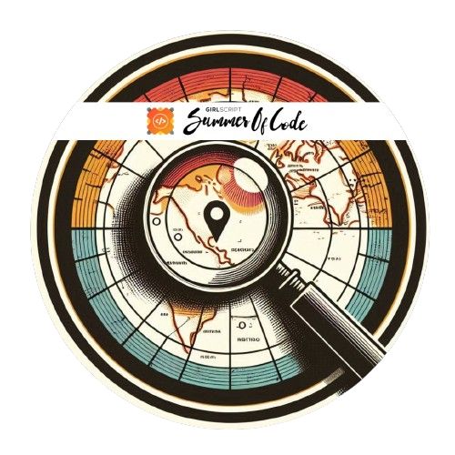
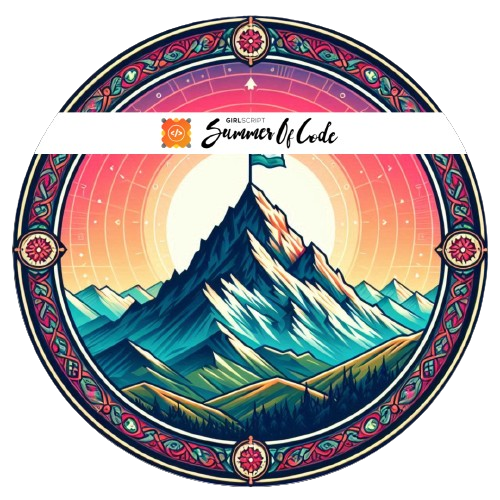

 

## 🌐 Socials:

 

## 💻 Tech Stack:

 

## 📊 GitHub Stats:

 

## 🏆 Trophies

# 🎖 Badges

<b> GSSoC'24 Badges </b>

<a href="https://gssoc.girlscript.tech/leaderboard">

  
  
  
  
  
  
  

 

  
<b> HoloPin Badges </b>

  

 

  <b>Thanks for your visit, I'm DrxyzzX7! If you appreciate my work, consider buying me a coffee. 😊</b>

  

